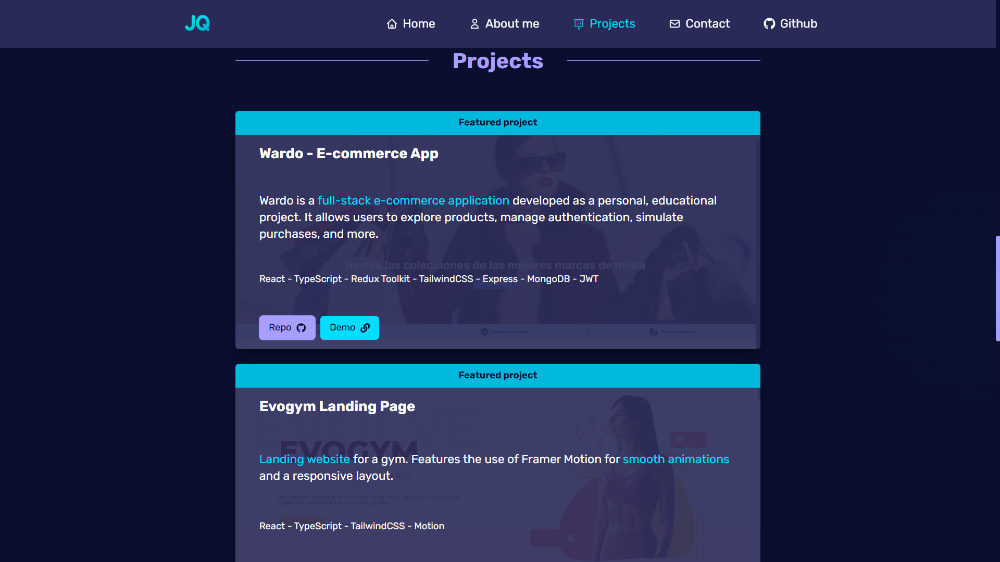
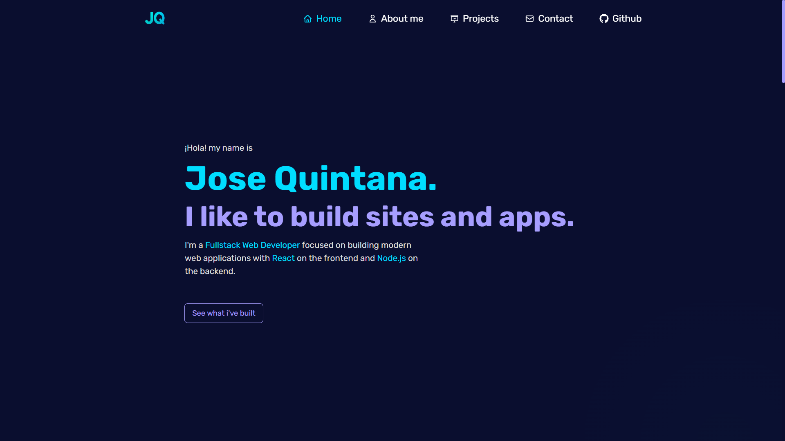

# 💼 Jose Quintana — Developer Portfolio

This is my personal portfolio as a **Fullstack Web Developer** focused on building modern, responsive, and accessible web applications using the **MERN Stack** and modern frontend tools.

## 📸 Screenshots





## 🚀 Live Demo

🔗 [Visit the Portfolio](https://regal-madeleine-9bce38.netlify.app/)

## 🛠️ Tech Stack

- **Frontend**: React · TypeScript · Tailwind CSS · Framer Motion
- **Routing & State**: React Router · Zustand
- **Build Tools**: Vite
- **Deployment**: Netlify
- **Other**: Git · Custom CSS · Responsive Design

## 📁 Features

- Smooth section-based navigation (scroll spy)
- Hero, About Me, Projects, Skills, and Contact sections
- Mobile-friendly responsive layout
- Animations with Framer Motion
- Project showcase with featured and regular projects
- Scroll-to-section utilities
- Custom theming and styling with Tailwind

## 🧠 About the Project

This portfolio was designed and built from scratch to reflect my skills as a fullstack developer. It includes both personal and guided projects, and demonstrates clean code organization, component reuse, and responsive design practices.


## 📂 Getting Started

To run the project locally:

```bash
git clone https://github.com/your-username/portfolio.git
cd portfolio
npm install
npm run dev
